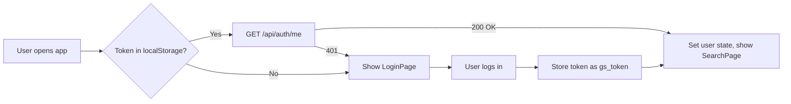

<div align="center">

# GoSafe — Frontend

**Safe Transit Navigator**

A modern, responsive React application for intelligent route planning with real-time safety scoring, live GPS tracking, and emergency SOS integration.

[](https://reactjs.org/)
[](https://vitejs.dev/)
[](https://leafletjs.com/)

[Features](#-features) • [Tech Stack](#-tech-stack) • [Getting Started](#-getting-started) • [Architecture](#-architecture) • [Deployment](#-deployment)

</div>

---

## Features

### Core Functionality
- **Intelligent Route Search** — Real-time autocomplete powered by Nominatim, displays up to 3 alternative routes with different paths
- **Interactive Maps** — Leaflet-based visualization with route polylines, custom markers for POIs, and smooth pan/zoom controls
- **Safety Scoring** — Visual indicators for route safety based on lighting, crowd density, CCTV coverage, and emergency access
- **Live GPS Tracking** — Real-time location updates using native browser geolocation API

### User Experience
- **Responsive Design** — Mobile-first CSS with breakpoints at 768px, 640px, and 390px for all device sizes
- **Instant Validation** — Client-side form validation with real-time feedback as you type
- **Password Strength Meter** — Visual indicator showing weak/fair/good/strong with color-coded progress bar
- **Smooth Animations** — CSS-based transitions for route cards, modals, and loading states

### Safety Features
- **Emergency SOS Button** — One-tap WhatsApp alert to all saved contacts with live GPS coordinates
- **Emergency Contacts** — Save up to 5 contacts with name, phone, and relationship
- **Route History** — Track your last 20 searches with timestamps and safety scores
- **Saved Routes** — Bookmark frequent trips for quick access

---

## Tech Stack

| Category | Technologies |
|----------|-------------|
| **Framework** | React 18.2 (Hooks-based, no class components) |
| **Build Tool** | Vite 5.0 (HMR, fast rebuilds) |
| **Mapping** | React-Leaflet 4.2, Leaflet 1.9, OpenStreetMap tiles |
| **HTTP Client** | Axios 1.6 with interceptors for JWT |
| **Styling** | CSS Modules (scoped per component) |
| **Icons** | Lucide React 0.263 |
| **State** | Context API + `useState`/`useEffect` (no Redux) |
| **Routing** | Custom page state machine in `App.jsx` |

---

## Getting Started

### Prerequisites

```bash
node --version   # 18.x or higher
npm --version    # 9.x or higher
```

### Installation

```bash
# Clone and navigate
cd gosafe/client

# Install dependencies
npm install

# Start dev server
npm run dev
```

The app will open at **http://localhost:5173**

> **Note:** Make sure the backend is running on port 3001 — the Vite proxy expects it there.

### Build for Production

```bash
npm run build      # outputs to dist/
npm run preview    # preview the production build locally
```

---

## Project Structure

```
client/
├── public/
│   └── logo_png.png              ← Your logo (100×100px min)
│
├── src/
│   ├── main.jsx                  ← Entry point, renders <App />
│   ├── App.jsx                   ← Top-level routing (page state machine)
│   ├── index.css                 ← Global CSS variables, resets, animations
│   │
│   ├── context/
│   │   └── AuthContext.jsx       ← JWT token, user state, all API calls
│   │
│   ├── services/
│   │   └── api.js                ← Axios instance + route search helpers
│   │
│   ├── utils/
│   │   └── validation.js         ← Form validation rules, password strength
│   │
│   ├── components/
│   │   ├── Navbar.jsx            ← Top nav with logo, links, user dropdown
│   │   ├── LoadingScreen.jsx     ← Animated radar rings + progress bar
│   │   ├── RouteCard.jsx         ← Individual route option with badges
│   │   ├── RouteMap.jsx          ← Leaflet map with polylines + POI markers
│   │   └── LiveTracker.jsx       ← GPS tracking panel
│   │
│   └── pages/
│       ├── SearchPage.jsx        ← Origin/destination search
│       ├── RoutesPage.jsx        ← Route comparison with safety scores
│       ├── MapPage.jsx           ← Full-screen map + sidebar + SOS button
│       └── auth/
│           ├── LoginPage.jsx     ← Login form with inline validation
│           ├── SignupPage.jsx    ← Signup with password strength meter
│           └── ProfilePage.jsx   ← Profile editor, route history, contacts
│
├── vite.config.js                ← Dev server config + API proxy
└── package.json
```

---

## Design System

### Color Palette

```css
--bg-primary:     #0a0c0f    /* Main background */
--bg-secondary:   #111318    /* Cards, elevated surfaces */
--bg-elevated:    #1a1e26    /* Modals, dropdowns */

--accent-green:   #009dff    /* Primary CTA, links (blue accent) */
--accent-amber:   #ffb800    /* Warnings */
--accent-red:     #ff3d3d    /* Errors, danger actions */

--text-primary:   #e8eaf0    /* Headings, body text */
--text-secondary: #7a8099    /* Labels, muted text */
--text-muted:     #3d4259    /* Placeholders, disabled */
```

### Typography

- **Display** — `Syne` (800 weight) for headings and brand text
- **Body** — `Space Mono` for UI labels, buttons, and metrics

### Responsive Breakpoints

```css
@media (max-width: 768px)  /* Tablets portrait */
@media (max-width: 640px)  /* Mobile landscape */
@media (max-width: 390px)  /* Small phones (iPhone SE) */
```

---

## Authentication Flow



- JWT stored in `localStorage` as `gs_token`
- Axios interceptor adds `Authorization: Bearer <token>` to every request
- Context API provides `{ user, login, logout, signup }` to all components

---

## Map Implementation

### Tech
- **Leaflet** — Core mapping library (vanilla JS)
- **React-Leaflet** — React wrapper for Leaflet primitives
- **Tile Layer** — OpenStreetMap (free, no API key)

### Features
- Route polylines with color-coded safety scores (green/amber/red)
- Custom markers for origin (green) and destination (red)
- POI markers for shops/restaurants (from Overpass API)
- Popup tooltips on marker hover
- Auto-zoom to fit entire route

### Performance
- Waypoints are decimated to max 200 points to avoid lag
- Markers are clustered if there are 30+ POIs

---

## Emergency SOS Flow

```javascript
// User clicks SOS button
1. Check if logged in → if not, show error
2. Check if emergency contacts exist → if not, show modal
3. Get GPS coordinates via navigator.geolocation
4. Build WhatsApp message:
   "SOS ALERT from GoSafe
   I need help! I'm currently travelling and may be in danger.
   "-" My live location: https://maps.google.com/?q=lat,lng
   "-" Route: origin → destination
   Please check on me immediately."
5. Open wa.me/<phone>?text=<message> for each contact
6. Stagger by 800ms to avoid popup blocking
7. Show success state for 5 seconds
```

No backend involved — pure client-side WhatsApp deep linking.

---

## 🔧 Configuration

### API Base URL

Change this before deploying:

**`src/context/AuthContext.jsx`**
```javascript
const API_BASE = 'https://gosafe-server.onrender.com' 
```

**`src/components/Navbar.jsx`**
```javascript
const API_BASE = 'https://gosafe-server.onrender.com'
```

### Vite Proxy (Dev Only)

**`vite.config.js`**
```javascript
proxy: {
  '/api': {
    target: 'https://gosafe-server.onrender.com',
    changeOrigin: true
  }
}
```


## 🧪 Development Tips

### Hot Module Replacement

Vite supports HMR — edit any `.jsx` or `.css` file and see changes instantly without page reload.

### Debugging API Calls

Open DevTools → Network tab → filter by `api` to see all requests.

### Force Token Refresh

```javascript
localStorage.removeItem('gs_token')
location.reload()
```

### Component Isolation

Each page and component has its own `.module.css` file — styles are scoped automatically. No global leaks.

---

## 📸 Screenshots

### Search Page
Origin/destination autocomplete with real-time suggestions from Nominatim.

### Routes Page
Side-by-side comparison of 3 alternative routes with safety scores, duration, distance, and nearby shops.

### Map Page
Interactive Leaflet map with route polyline, POI markers, and bottom action bar with SOS button.

### Profile Page
Tabbed interface for profile editing, route history, saved routes, and emergency contacts management.

---
</div>
